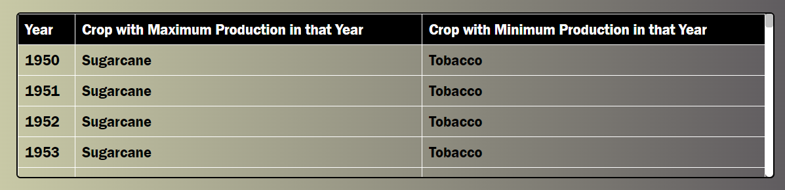
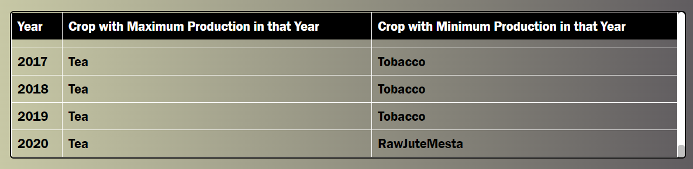
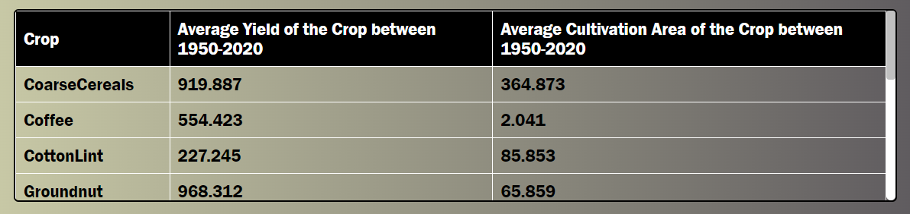
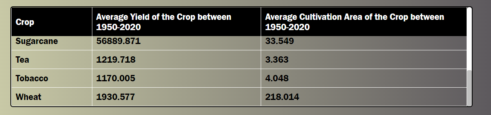
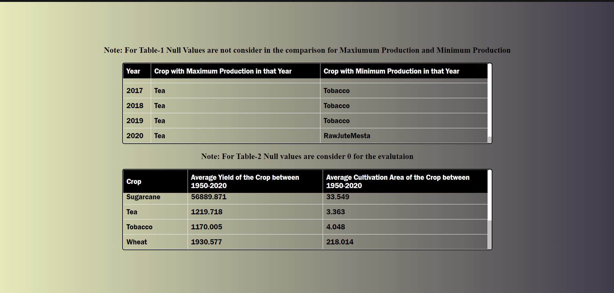
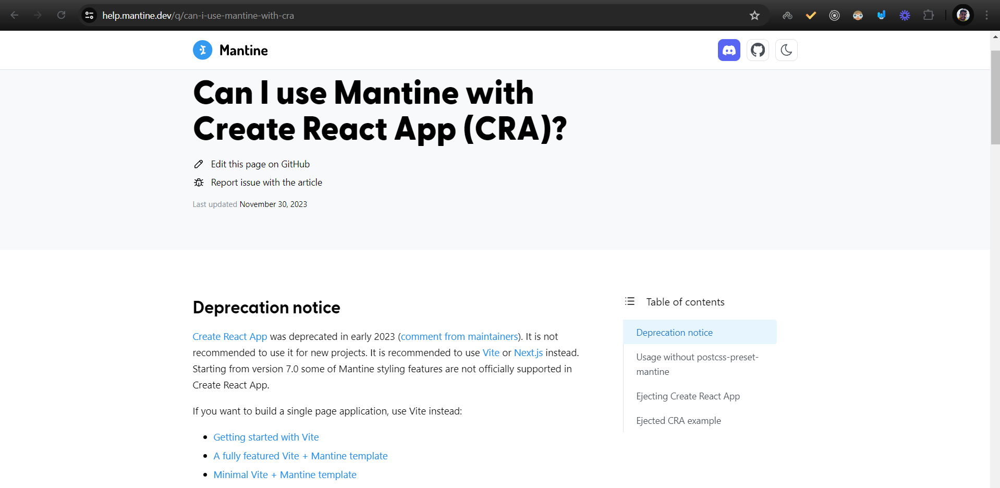

# Getting Started with Create React App

This project was bootstrapped with [Create React App](https://github.com/facebook/create-react-app).

## How To Run the Project
1. Move to your desired Diretory
2. Clone this repository using git clone https://github.com/Kunalkbhatia/data-analysis-task.git
3. cd data-analysis-task
3. yarn install
4. yarn start
5. And the project will run on local host

# ScreenShots

## Table-1

## Table-2

## Full Screen

# Please Note
# I have to use a little bit css becasue as mention in docs that React CRA is to used,  Mantine doest support CSS/PostCss anymore to CRA Application.

### `yarn start`

Runs the app in the development mode.\
Open [http://localhost:3000](http://localhost:3000) to view it in the browser.

The page will reload if you make edits.\
You will also see any lint errors in the console.
